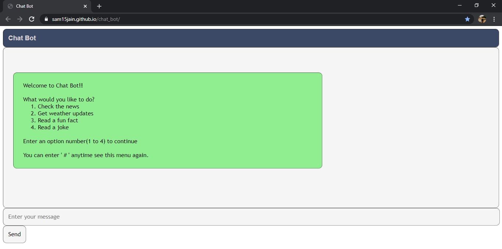
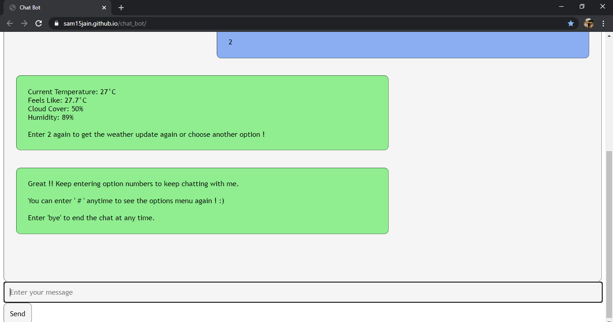
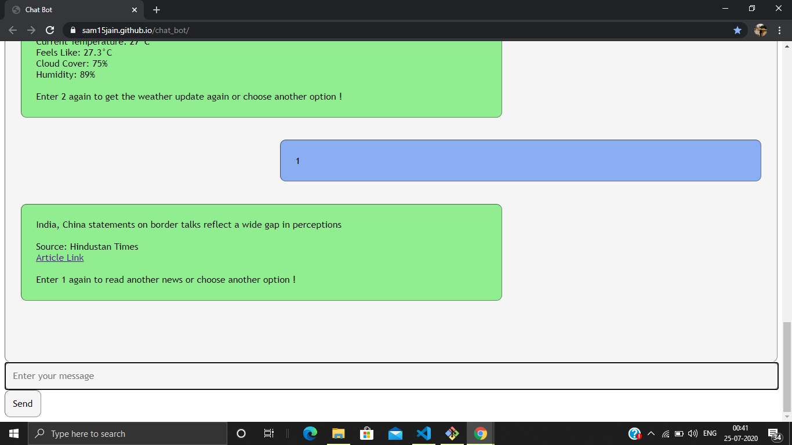

<!-- Author : Samyak Jain
	Created on : 15 July 2020 -->

# Chat Bot Web App

## About

* Made with JAVASCRIPT , HTML and CSS
* Website Link : https://sam15jain.github.io/chat_bot/
* Uses various API calls to provide latest News, Weather Updates, Facts and Jokes

## User Interface

* Bot welcomes the user at the beginning and provides various options to perform different actions

* User can enter numbers from 1 to 4 to perform various actions like

	* checking the news 
	
	

	* getting weather updates

	

	* reading fun facts

	

	* reading jokes

	

	* new jokes, facts, news and weather updates are shown as the user keeps entering these options 

* The Website is made responsive with CSS and sounds are added to enhance the user experience

* User can also perform other actions like

	* enter '#' to see the options menu again 

	

	* enter 'bye' to end the chat

	

	* enter 'reset' to restart the chat again after the chat has ended

* Further instructions are provided if user gives invalid input

